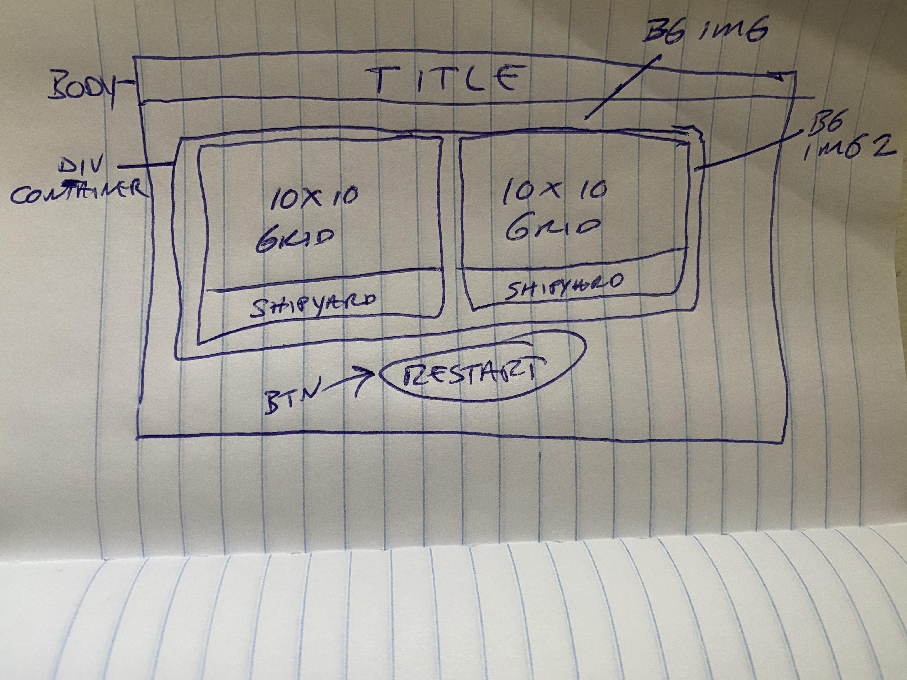

# game-project# mbocon.github.io
Game link :

https://mbocon.github.io/

Technologies used : 

[HTML](https://developer.mozilla.org/en-US/docs/Web/HTML) 
[CSS](https://developer.mozilla.org/en-US/docs/Web/CSS) 
[Javascript](https://developer.mozilla.org/en-US/docs/Web/JavaScript) 
[jQuery](https://jquery.com/) 
[jQuery UI](https://jqueryui.com/) 

Quick sketch of page layout and code structure :

 
 

GAME FLOW :

Player 1 starts by dragging and dropping submarines to the player grid 
Once player board is set-up the Player goes first by targeting/clicking an enemy square 
If a hidden enemy is located on the selected square the background-color of that square will change to red to indicate a hit 
If no enemy is present the background-color changes to teal to indicate a miss 
After player selects an enemy square the CPU retaliates by selecting a random player square 
If the selected player square holds a ship and the CPU selected correctly the color of players ship will change to red to indicate a hit 
Game continues until all player ships or all enemy ships are destroyed and the winner is announced

UNRESOLVED BUGS/ISSUES :

- Figure out why enemy ships are sometimes doubling up at same location on random deployment 
- Fix game logic to prevent double clicking when the player attacks to prevent destroyed enemy ship from changing colors again 
- Fix occasional double clicking on drag/drop for player deployment 

STILL NEED TO IMPLEMENT FOR BETTER UX :

- Change background color of randomly selected div if cpu attack misses 
- Add modals for when player destroys enemy 
- Need to build cross-platform responsiveness 

